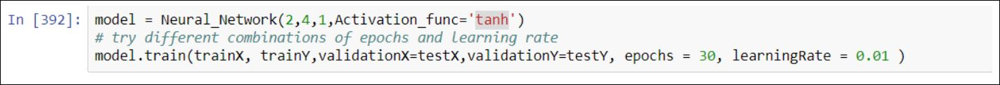

# Single-Hidden-Layer-Neural-Network-Implementation-in-Python
It is implementation of Single Hidden layer neural network. Laye may have any number of neurons. It is using Sample dataset. This implementation is not for the commercial purpose instead it is for understanding and learning purpose
## Implementation of Neural Network with a single hidden layer
## Multiple activation function and cross entropy loss function

Steps for the implementation are below:
- Create a class named as Neural_Network which will take number of input and number of output as a parameter.
  - Input size: is the size of feature vector which will be feed as input in our NN. In our case it is 2, pass it as a parameter.
  - Hidden layer: number of neurons in hidden layer of the architecture.
  - Output size: is the size output layer, number of neurons that will be in output layer.
  - Randomly initialize W1 and W2 i.e. Weight matrix of input layer to hidden layer, hidden layer to output layer respectively.
  - Pass activation function as an input in the class e.g. ‘Sigmoid’, ‘Tanh’ or ‘Relu’.
- Below is the list of functions which you need to implement within the class Neural_Network,description of each function is provided in the source code.
  - Feedforward (self, X)
    - X is input feature(s)
    - Return predicted vector(s)
  - Backpropogation (self,X, Y, y_pred, lr):
    - X is input feature(s)
    - Y is actual label(s)
    - Y_pred is predicted value(s)
    - Lr is learning rate
  - Sigmoid(self, s)
    - Return sigmoid applied on s value(s)
  - Sigmoid_derivative(self, s)
    - Return derivate of sigmoid, on s
  - tanh(self, s)
    - Return tanh applied on s value(s)
  - tanh_derivative(self, s)
    - Return derivate of tanh, on s
  - relu(self, s)
    - Return relu applied on s value(s)
  - relu_derivative(self, s)
    - Return derivate of relu, on s
  - Crossentropy(self, Y, Y_pred)
    - Y is the actual label(s)
    - Y_pred is predicted label(s)
    - Return error based on crossentropy
  - Train(self, trainX, trainY,epochs = 100, learningRate = 0.001, plot_err = True ,validationX = Null, validationY = Null)
    - trainX is the training feature dataset in row format
    - trainY is the label of the dataset
    - epochs is the number of times entire dataset will be passed to the network for training, default value is 100.
    - learningRate is the constant used for weight updation
    - plot_err bool variable if you want to plot error on a graph or not
    - validationX is the validation feature dataset in row format, show validation error in each epoch
    - validationY is the validation label of the dataset.
  - Save_model(self,name)
    - Save the model under the name of ‘name’
  - Load_model(self,name)
    - Load the model using ‘name’.
  - Accuracy(self, testX, testY)
    - testX is dataset for testing
    - testY is the labels of test data
    - plot accuracy on an image
    - return accuracy
  - predict(self, testX)
    - testX is the test row feature
    - return predicted value on testX
    
###    Approach:
Initialize neural network with two layers one with 3 neurons and other one is single neuron
layered.  
Initialized the weight vectors with an additional column for bias. As I am taking the weigh vector as row matrix and not taking transpose while calculating w transpose x.  

There is a parameter Activvation_func which takes the name of activation function use string (tanh,sigmoid,relu) for different activation function.  
Currently I am using tanh on first layer and sigmoid on the second one. And the accuracy is 100%.  
